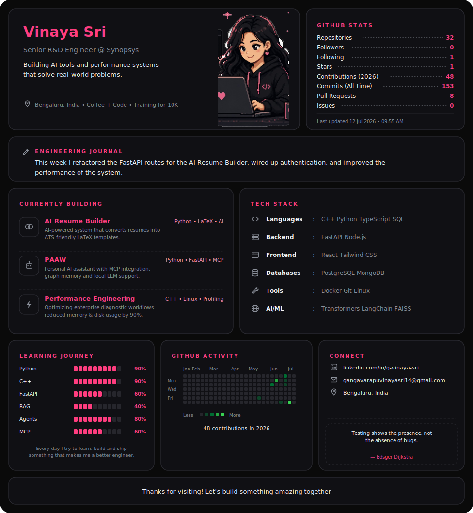

<!-- ────────────────────────────────────────────────────────────── -->
<!--  GitHub Profile OS — generated by update.py. Do not edit by hand.  -->
<!--  Edit config.json instead; the daily GitHub Action rebuilds this.  -->
<!-- ────────────────────────────────────────────────────────────── -->

<picture>
  <source media="(prefers-color-scheme: dark)" srcset="assets/dashboard-dark.svg">
  <source media="(prefers-color-scheme: light)" srcset="assets/dashboard-light.svg">
  
</picture>

[GitHub](https://github.com/VinayaSri22)  ·  [LinkedIn](https://linkedin.com/in/g-vinaya-sri)  ·  [Email](mailto:gangavarapuvinayasri14@gmail.com)

