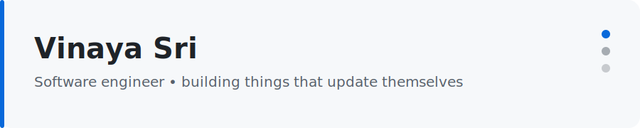

<!-- Header banner: switches automatically between light and dark GitHub themes. -->
<picture>
  <source media="(prefers-color-scheme: dark)" srcset="./assets/header-dark.svg">
  <source media="(prefers-color-scheme: light)" srcset="./assets/header-light.svg">
  
</picture>

  

---

### 👋 About

Welcome to my corner of GitHub. This profile rebuilds itself on a schedule, so what you see below is always fresh.

### ⚡ Now

<!-- NOW:START -->
- 🔭 **Working on:** exploring self-updating developer tooling
- 🌱 **Learning:** system design & clean automation
- 💬 **Ask me about:** Python, GitHub Actions, automation
<!-- NOW:END -->

### 📡 Recent activity

<!-- ACTIVITY:START -->
- Merged PR #1 in [`VinayaSri22/VinayaSri22`](https://github.com/VinayaSri22/VinayaSri22) — just now
- Pushed 1 commit to [`VinayaSri22/VinayaSri22`](https://github.com/VinayaSri22/VinayaSri22) — just now
- Opened PR #1 in [`VinayaSri22/VinayaSri22`](https://github.com/VinayaSri22/VinayaSri22) — just now
- Created branch in [`VinayaSri22/VinayaSri22`](https://github.com/VinayaSri22/VinayaSri22) — 1m ago
- Created branch in [`VinayaSri22/VinayaSri22`](https://github.com/VinayaSri22/VinayaSri22) — 18m ago
<!-- ACTIVITY:END -->

---

<!-- UPDATED:START -->
_Last updated: 11 Jul 2026, 16:03 (Asia/Kolkata) — auto-generated._
<!-- UPDATED:END -->

